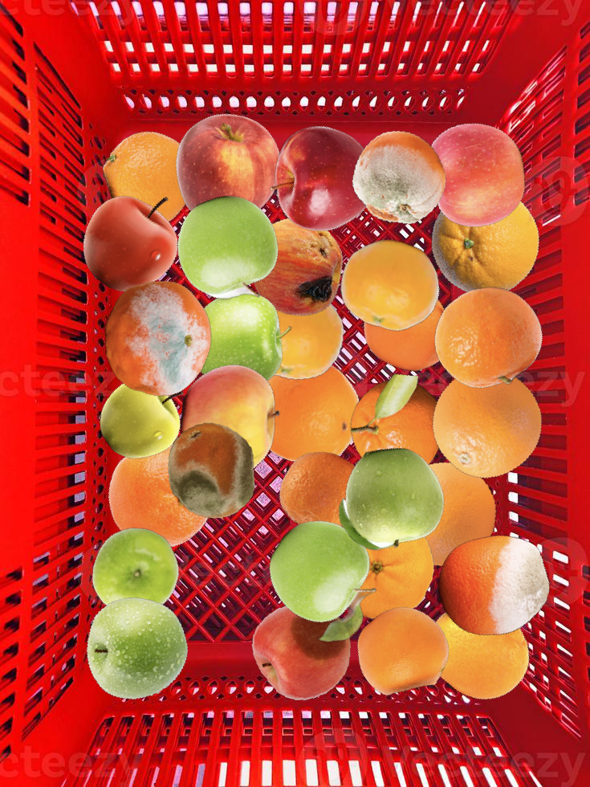
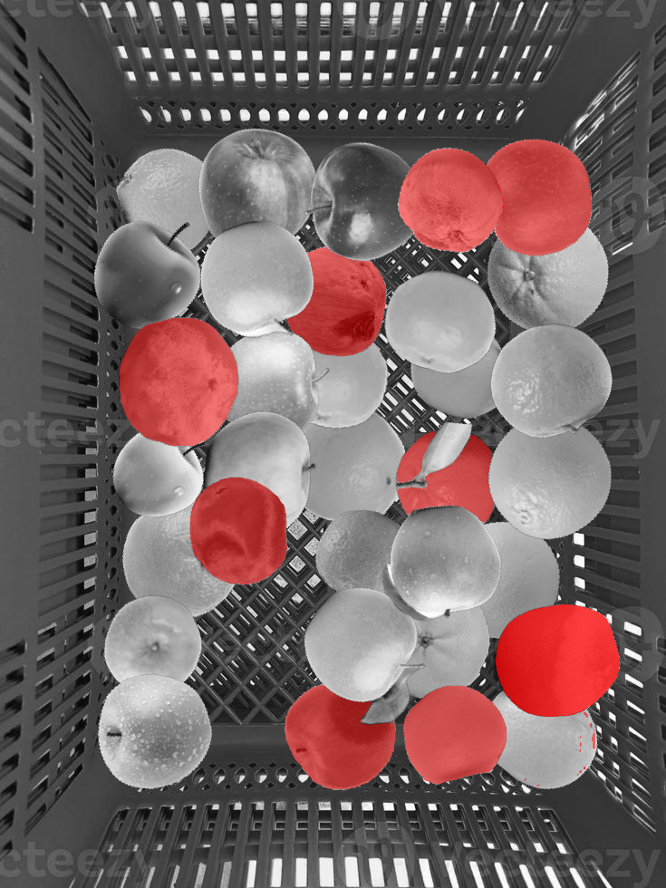
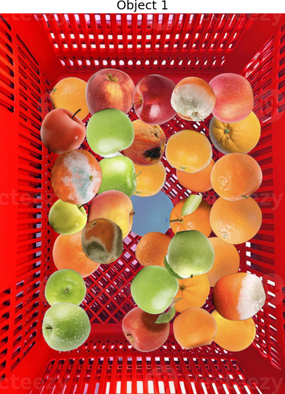
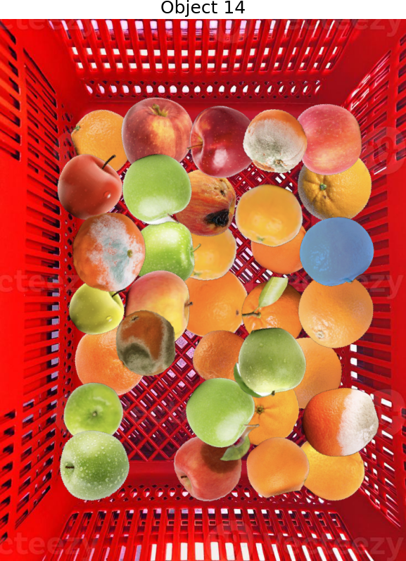
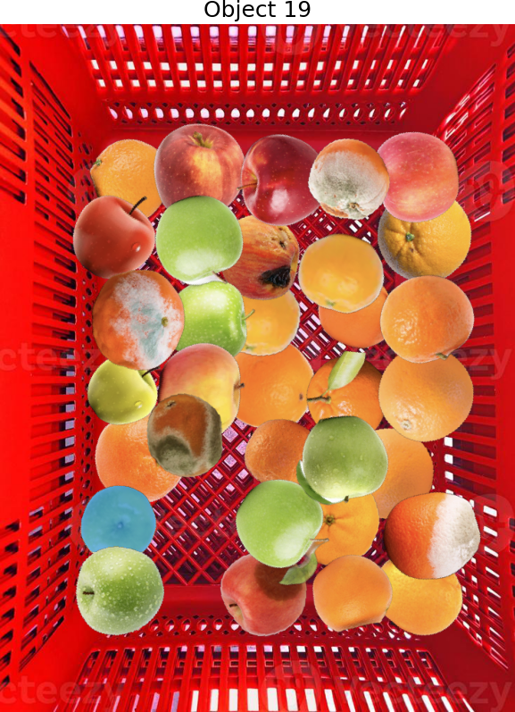
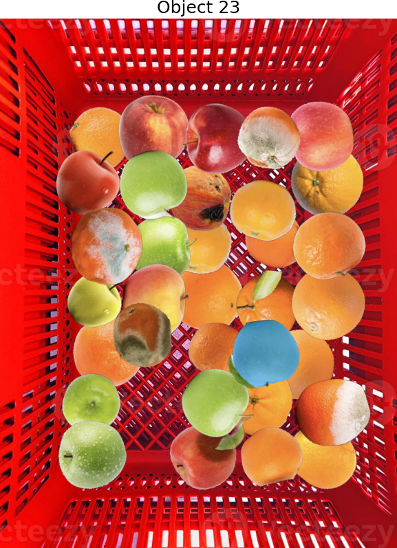

# Instrucciones para poder generar los datos sintéticos y ejecutar el modelo (ya viene con parámetros pre-entrenados, pero los datos pesan demasiado como para ponerlos aquí)
1. Descargar el siguiente dataset: https://www.kaggle.com/datasets/sriramr/fruits-fresh-and-rotten-for-classification, y descomprimirlo si es necesario.
2. Ejecutar _remove_background.py_, especificando, en la línea 16, dónde está el directorio con los datos del dataset que se descargó en el paso 1, y a qué directorio se quiere que terminen las imágenes sin fondo.
    - Este código elimina el fondo de todas las imágenes PNG en el directorio de origen especificado y sus subdirectorios, guardando las imágenes resultantes con fondos transparentes en las rutas correspondientes bajo el directorio de destino.
3. Ejecutar _image_cleanser.py_, modificando en la penúltima línea del código la dirección al directorio de las frutas sin fondo (o con fondo transparente, mejor dicho).
    - Este código se encarga de eliminar aquellas frutas del dataset que no están completas (la foto está recortada). Al fin y al cabo, no podemos poner frutas recortadas en la canasta. No tiene sentido (así no es una canasta real). También es importante mencionar que se eliminaron algunas imágenes de frutas que contenían frutas repetidas. Sin embargo, como esto se hizo manualmente, no hay un script para eso.
4. Eliminar manualmente, de las frutas sin fondo (después de haber ejecutado el paso 3), aquellas que contengan más de una fruta. Esto tiene que hacerse manualmente. Sin embargo, si no se hace, igualmente funcionará el modelo, solo que con menos precisión, ya que habrá irregularidad de tamaños (tamaños no-realistas, al tener varias frutas en el espacio de solo una).
5. Ejecutar _generate_fruit_baskets.py_. Mirar en las últimas líneas del script, donde se llama a la función _make_one_basket_ repetidas veces, que los directorios coincidan con dónde están los datos. Si no es el caso, hacer la modificación.
    - Este script se encarga de la generación del dataset sintético. El dataset descargado de Kaggle en el paso 1 únicamente contiene frutas podridas y frescas, pero la "gracia" de nuestro modelo es que, con una imagen de una canasta con frutas, se puedan detectar cuáles de ellas están frescas y cuáles podridas. Para esto generamos el dataset sintético, colocando frutas escogidas aleatoriamente en posiciones, rotaciones y tamaños aleatorios dentro de una canasta.
    - También es importante mencionar que esta función separa datos de validación, entrenamiento y prueba. Las frutas de entrenamiento y validación vienen de los datos "train" del dataset de Kaggle. Las frutas de prueba vienen de los datos "test".
6. Ejecutar _basket_inference.py_, pasando los argumentos correctos a la función infer_one_basket. Los parámetros sam_model y checkpoint_path hacen referencia al modelo de segmentación que se desea usar. Los pesos correspondientes (pre-entrenados) se deben descargar de https://github.com/facebookresearch/segment-anything?tab=readme-ov-file#model-checkpoints.

Los pesos pre-entrenados del clasificador de frutas provienen del siguiente trabajo de entrenamiento:
https://www.kaggle.com/code/anshuls235/pytorch-starter/notebook

# Overview ultra-simplificado del funcionamiento del modelo:

El modelo recibe una imagen como la de la izquierda (_model_input.png_ en el repo).
Su output es una imagen como la de la derecha (_model_output.png_ en el repo). Esta imagen es real, output de nuestro modelo.
Las frutas resaltadas en rojo son las que el modelo ha detectado como podridas. Cabe mencionar que la marca de agua es proveniente de la _stock image_ que utilizamos para la canasta. Nuestro modelo está implementado usando librerías open source y no genera marcas de agua.
 

## Paso 1: Segmentación
Nuestro modelo usa el modelo pre-entrenado de Meta "Segment Anything" (https://github.com/facebookresearch/segment-anything) para segmentar las frutas. Para esto, recibe una imagen de canasta (como _model_input.png_), y crea una máscara binaria para cada una de las frutas. Aquí hay un ejemplo de cómo se van generando las máscaras por fruta para algunas de las frutas:

No siempre las máscaras salen tan perfectas como en los ejemplos de arriba, aunque son ejemplos completamente reales de pasos intermedios de nuestro modelo. Tambien es importante mencionar que el modelo, antes de hacer su inferencia, recibe un punto (x, y) por cada fruta. Cada punto está "dentro" de los límites de la fruta. Esto lo necesita Segment Anything para poder hacer la inferencia más precisa, y en un caso de uso real los puntos podrían obtenerse mediante clics en las frutas (en el caso de una app web) o taps (en el caso de una app móvil). Para nuestra información sintética, los puntos se generaron de manera que aparecían en una ubicación casi aleatoria dentro de los límites de la fruta, esto para imitar un caso real de asignación de puntos. Posiblemente, en un futuro, se pueda hacer que el mismísimo modelo genere los puntos por él mismo. **La parte del código principalmente encargada de esto se encuentra en _mask_generator.py_**.

## Paso 2: Clasificación
Con las máscaras obtenidas, se procede a obtener cada fruta por separado. Cada fruta por separado se pasa entonces a un modelo de clasificación (una red convolucional), cuyos detalles/arquitectura se pueden consultar en *fruit_classifier.py*. Es básicamente una red neuronal convolucional. Este modelo, por cada fruta, decide si está podrida o no. Se va guardando la cuenta y los identificadores de cada fruta podrida, para generar la imagen y datos finales.

# Rendimiento del modelo
Gracias a que Segment Anything tiene 3 variantes, nuestro modelo también. Se hicieron pruebas con 100 canastas nunca-antes vistas por el modelo (bueno, la canasta de fondo sí, pero con frutas nunca antes vistas), que corresponden al _test set_, que el modelo pre-entrenado de clasificación (el del Paso 2) nunca pudo ver durante su entrenamiento. Los resultados se pueden ver en _results.txt_, pero también se pondrán aquí:

| Model   | Average time (s)      | PMAE (%) | Successful counts |
|---------|----------------------|----------|-------------------|
| vit_b   | 26.057398289442062   | 14.56    | 100               |
| vit_l   | 31.754346042871475   | 8.96     | 100               |
| vit_h   | 37.943743308385216   | 11.08    | 100               |

Se puede ver que la mejor variante es vit_l. Es la que tiene un PMAE más bajo, y un tiempo promedio de inferencia (por canasta) bastante "promedio" en comparación con las otras dos opciones. El PMAE se calcula hallando la diferencia entre la cantidad de frutas podridas en la canasta, y la cantidad de frutas podridas detectadas por el modelo, dividida entre la cantidad de frutas totales.

# Intento fallido: DeepLab
Inicialmente se intentó abordar este reto mediante segmentación semántica, utilizando la arquitectura DeepLab V3, que también se basa en convoluciones. Sin embargo, esto significó tener que entrenar desde cero muchas cosas, y al no contar con el poder de cómputo necesario, se tuvo que optar por una solución con un grado más alto de pre-entrenamiento, como lo es nuestra arquitectura Segment Anything + CNN. Después de más de 24 horas de entrenamiento continuo, además de una larga investigación acerca de los mejores hiperparámetros y configuraciones, nuestro modelo DeepLab V3 mostraba resultados extremadamente insuficientes, como se puede ver en la siguiente imagen:

